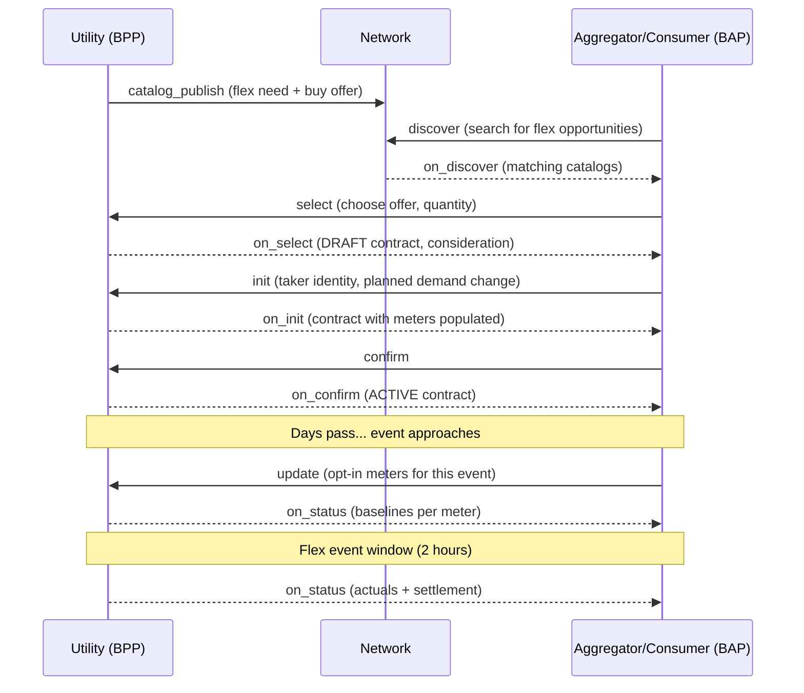

# Demand Flexibility Implementation Guide <!-- omit from toc -->

Version 0.1 (Draft / Non-Normative)

## Table of Contents <!-- omit from toc -->

- [1. Introduction](#1-introduction)
- [2. Terminology](#2-terminology)
- [3. User Journey](#3-user-journey)
- [4. Architecture](#4-architecture)
  - [4.1. Schemas](#41-schemas)
  - [4.2. Beckn v2 Contract Mapping](#42-beckn-v2-contract-mapping)
- [5. Message Flow](#5-message-flow)
  - [5.1. Catalog Publish](#51-catalog-publish)
  - [5.2. Select](#52-select)
  - [5.3. On Select](#53-on-select)
  - [5.4. Init](#54-init)
  - [5.5. On Init](#55-on-init)
  - [5.6. Confirm](#56-confirm)
  - [5.7. On Confirm](#57-on-confirm)
  - [5.8. Update (Opt-In with Meters)](#58-update-opt-in-with-meters)
  - [5.9. On Status (Baselines)](#59-on-status-baselines)
  - [5.10. On Status (Actuals and Settlement)](#510-on-status-actuals-and-settlement)
- [6. Schema Reference](#6-schema-reference)
  - [6.1. DemandFlexNeed](#61-demandflexneed)
  - [6.2. DemandFlexBuyOffer](#62-demandflexbuyoffer)
  - [6.3. DEGContract](#63-degcontract)
  - [6.4. DemandFlexPerformance](#64-demandflexperformance)
- [7. Policy and Settlement](#7-policy-and-settlement)
- [8. Implementation Notes](#8-implementation-notes)
  - [8.1. For BAPs (Consumer / Aggregator)](#81-for-baps-consumer--aggregator)
  - [8.2. For BPPs (Utility)](#82-for-bpps-utility)
- [9. Devkit](#9-devkit)

---

## 1. Introduction

Behavioral Demand Response (also called demand-flex) allows utilities to procure load flexibility from consumers and aggregators during peak demand periods. Instead of building more generation or grid capacity, utilities publish flex needs on the network and incentivize participants to reduce (or shift) their consumption during specific event windows.

This guide describes how demand-flex contracts are modeled on the Beckn protocol using the new v2.0.0 **Contract** object, with domain-specific schemas for the energy vertical (DEG).

### Key Concepts

- **Flex Need**: A utility's requirement for demand change (increase or reduction) during a specific event window
- **Buy Offer**: The commercial terms under which the utility will compensate flex providers
- **Taker**: The consumer or aggregator providing flex capacity — identified by meters
- **M&V (Measurement & Verification)**: Baselines and actuals used to compute verified flex
- **Rego Policy**: An OPA policy that defines revenue flows and validates invoices

## 2. Terminology

| Term | Definition |
|:-----|:-----------|
| **BAP** | Beckn Application Platform — the consumer or aggregator's system |
| **BPP** | Beckn Provider Platform — the utility's system |
| **Flex Event** | A time-bounded period during which demand change is needed |
| **Baseline** | Expected load per meter, computed from historical data (e.g., best 5 of last 10 days) |
| **Actual** | Measured load per meter during the flex event |
| **Curtailment** | Reduction in consumption below baseline |
| **Guaranteed Flex** | Firm commitment subject to penalty for under-delivery and premium for commitment |
| **Opt-In/Opt-Out** | Per-event participation control; default set in contract terms |

## 3. User Journey



### Long-Term Contracts

For recurring flex programs, a single `confirm` creates the long-term contract. Each event is handled via `update` (opt-in/out, meter list changes) and `on_status` (baselines, actuals, settlement). The participating meters list can change before each event.

## 4. Architecture

### 4.1. Schemas

Four domain schemas are used, each mapping to a specific attribute slot on the Beckn v2 Contract:

| Schema | Beckn Slot | Purpose |
|:-------|:-----------|:--------|
| **DemandFlexNeed** | `Resource.resourceAttributes` | What the utility needs: direction, event window, capacity, location |
| **DemandFlexBuyOffer** | `Offer.offerAttributes` | Commercial terms: incentive, penalties, premiums, taker, policy |
| **DEGContract** | `Contract.contractAttributes` | Domain marker: contract type (DEMAND_FLEX) |
| **DemandFlexPerformance** | `Performance.performanceAttributes` | M&V data: methodology, per-meter baselines and actuals |

### 4.2. Beckn v2 Contract Mapping

The demand-flex flow uses the new Beckn v2.0.0 `Contract` object (replacing the legacy `Order`):

```
Contract
├── status: DRAFT → ACTIVE → COMPLETE
├── participants[]: utility, consumer/aggregator
├── commitments[]
│   ├── resources[]: DemandFlexNeed (what's needed)
│   └── offer: DemandFlexBuyOffer (commercial terms + taker)
├── consideration[]: computed incentive amounts
├── performance[]: M&V baselines and actuals (on_status)
├── settlements[]: revenue flows computed by rego (post-event)
└── contractAttributes: DEGContract (domain marker)
```

The `DemandFlexBuyOffer.taker` field is progressively filled:
1. **Catalog / Select**: `taker: null`
2. **Init**: `taker: { id, plannedDemandChange, participatingMeters: [] }`
3. **On Init / Update**: `taker: { id, plannedDemandChange, participatingMeters: [meter1, meter2, ...] }`

## 5. Message Flow

All examples use Beckn v2.0.0 with camelCase context fields (`bapId`, `bppId`, `transactionId`, `messageId`).

### 5.1. Catalog Publish

The utility publishes a flex catalog containing:
- A **Resource** with `DemandFlexNeed` attributes (direction, event window, capacity)
- An **Offer** with `DemandFlexBuyOffer` attributes (incentive, penalties, policy reference)
- `availableTo` restricting visibility to `beckn.deg.india` network

<details><summary><a href="../../../../examples/demand-flex/v2/publish-catalog.json">publish-catalog.json</a></summary>

```json
{
  "context": {
    "version": "2.0.0",
    "action": "catalog_publish",
    "domain": "beckn.one:deg:demand-flex:2.0.0",
    "bppId": "tpddl-utility.example.com",
    "bppUri": "https://tpddl-utility.example.com/beckn",
    "messageId": "msg-publish-001",
    "timestamp": "2026-03-28T06:00:00Z",
    "schemaContext": [
      "https://raw.githubusercontent.com/beckn/DEG/refs/heads/p2p-trading-becknv2/specification/schema/DemandFlexBuyOffer/v2.0/context.jsonld",
      "https://raw.githubusercontent.com/beckn/DEG/refs/heads/p2p-trading-becknv2/specification/schema/DemandFlexNeed/v2.0/context.jsonld"
    ]
  },
  "message": {
    "catalogs": [
      {
        "id": "catalog-flex-tpddl-2026-04",
        "descriptor": {
          "@type": "beckn:Descriptor",
          "name": "TPDDL Demand Flex - April 2026",
          "shortDesc": "Peak demand reduction opportunities for North Delhi"
        },
        "provider": {
          "id": "tpddl-north-delhi",
          "descriptor": {
            "@type": "beckn:Descriptor",
            "name": "TPDDL North Delhi Distribution"
          }
        },
        "resources": [
          {
            "id": "flex-need-north-delhi-apr1",
            "descriptor": {
              "@type": "beckn:Descriptor",
              "name": "Peak Demand Flex - North Delhi",
              "shortDesc": "500 kW curtailment needed Apr 1, 2-4pm IST"
            },
            "resourceAttributes": {
              "@context": "https://raw.githubusercontent.com/beckn/DEG/refs/heads/p2p-trading-becknv2/specification/schema/DemandFlexNeed/v2.0/context.jsonld",
              "@type": "DemandFlexNeed",
              "direction": "REDUCE",
              "eventWindow": {
                "startDate": "2026-04-01T08:30:00Z",
                "endDate": "2026-04-01T10:30:00Z"
              },
              "capacityType": "CURTAILMENT",
              "maxCapacityKw": 500,
              "location": {
                "type": "Point",
                "coordinates": [77.2090, 28.6139]
              }
            }
          }
        ],
        "offers": [
          {
            "id": "offer-flex-001",
            "descriptor": {
              "@type": "beckn:Descriptor",
              "name": "Standard Flex @ 3.50 INR/kWh",
              "shortDesc": "Demand reduction with 5.00 INR/kWh premium for guaranteed flex"
            },
            "resourceIds": ["flex-need-north-delhi-apr1"],
            "validity": {
              "startDate": "2026-03-28T00:00:00Z",
              "endDate": "2026-04-01T08:30:00Z"
            },
            "availableTo": [
              { "type": "NETWORK", "id": "beckn.deg.india" }
            ],
            "offerAttributes": {
              "@context": "https://raw.githubusercontent.com/beckn/DEG/refs/heads/p2p-trading-becknv2/specification/schema/DemandFlexBuyOffer/v2.0/context.jsonld",
              "@type": "DemandFlexBuyOffer",
              "incentivePerKwh": 3.50,
              "currency": "INR",
              "maxEventsPerMonth": 5,
              "baselineMethodology": {
                "bestOf": 5,
                "outOf": 10
              },
              "penaltyRate": 1.50,
              "premiumForGuaranteed": 5.00,
              "optOutDefault": false,
              "taker": null,
              "policy": {
                "url": "https://raw.githubusercontent.com/beckn/DEG/refs/heads/p2p-trading-becknv2/specification/policies/demand_flex.rego",
                "queryPath": "data.deg.contracts.demand_flex"
              }
            }
          }
        ]
      }
    ]
  }
}

```
</details>

### 5.2. Select

The consumer selects an offer with a desired quantity. The contract carries the full resource and offer from the catalog. Taker is `null` at this stage — no consumer identity provided yet.

<details><summary><a href="../../../../examples/demand-flex/v2/select-request.json">select-request.json</a></summary>

```json
{
  "context": {
    "version": "2.0.0",
    "action": "select",
    "domain": "beckn.one:deg:demand-flex:2.0.0",
    "bapId": "greenflex-agg.example.com",
    "bapUri": "https://greenflex-agg.example.com/beckn",
    "bppId": "tpddl-utility.example.com",
    "bppUri": "https://tpddl-utility.example.com/beckn",
    "transactionId": "txn-flex-001",
    "messageId": "msg-select-001",
    "timestamp": "2026-03-30T10:00:00Z",
    "schemaContext": [
      "https://raw.githubusercontent.com/beckn/DEG/refs/heads/p2p-trading-becknv2/specification/schema/DemandFlexBuyOffer/v2.0/context.jsonld",
      "https://raw.githubusercontent.com/beckn/DEG/refs/heads/p2p-trading-becknv2/specification/schema/DemandFlexNeed/v2.0/context.jsonld",
      "https://raw.githubusercontent.com/beckn/DEG/refs/heads/p2p-trading-becknv2/specification/schema/DEGContract/v2.0/context.jsonld"
    ]
  },
  "message": {
    "contract": {
      "@type": "beckn:Contract",
      "status": { "@type": "beckn:Descriptor", "code": "DRAFT" },
      "participants": [
        {
          "id": "tpddl-north-delhi",
          "descriptor": { "@type": "beckn:Descriptor", "name": "TPDDL North Delhi Distribution" }
        },
        {
          "id": null,
          "descriptor": { "@type": "beckn:Descriptor", "name": "Taker (to be provided at init)" },
          "participantAttributes": null
        }
      ],
      "commitments": [
        {
          "status": {
            "descriptor": { "@type": "beckn:Descriptor", "code": "DRAFT" }
          },
          "resources": [
            {
              "id": "flex-need-north-delhi-apr1",
              "descriptor": {
                "@type": "beckn:Descriptor",
                "name": "Peak Demand Flex - North Delhi",
                "shortDesc": "500 kW curtailment needed Apr 1, 2-4pm IST"
              },
              "quantity": { "unitCode": "kW", "unitQuantity": 150 },
              "resourceAttributes": {
                "@context": "https://raw.githubusercontent.com/beckn/DEG/refs/heads/p2p-trading-becknv2/specification/schema/DemandFlexNeed/v2.0/context.jsonld",
                "@type": "DemandFlexNeed",
                "direction": "REDUCE",
                "eventWindow": {
                  "startDate": "2026-04-01T08:30:00Z",
                  "endDate": "2026-04-01T10:30:00Z"
                },
                "capacityType": "CURTAILMENT",
                "maxCapacityKw": 500,
                "location": {
                  "type": "Point",
                  "coordinates": [77.2090, 28.6139]
                }
              }
            }
          ],
          "offer": {
            "id": "offer-flex-001",
            "resourceIds": ["flex-need-north-delhi-apr1"],
            "offerAttributes": {
              "@context": "https://raw.githubusercontent.com/beckn/DEG/refs/heads/p2p-trading-becknv2/specification/schema/DemandFlexBuyOffer/v2.0/context.jsonld",
              "@type": "DemandFlexBuyOffer",
              "incentivePerKwh": 3.50,
              "currency": "INR",
              "maxEventsPerMonth": 5,
              "baselineMethodology": { "bestOf": 5, "outOf": 10 },
              "penaltyRate": 1.50,
              "premiumForGuaranteed": 5.00,
              "optOutDefault": false,
              "taker": null,
              "policy": {
                "url": "https://raw.githubusercontent.com/beckn/DEG/refs/heads/p2p-trading-becknv2/specification/policies/demand_flex.rego",
                "queryPath": "data.deg.contracts.demand_flex"
              }
            }
          }
        }
      ],
      "contractAttributes": {
        "@context": "https://raw.githubusercontent.com/beckn/DEG/refs/heads/p2p-trading-becknv2/specification/schema/DEGContract/v2.0/context.jsonld",
        "@type": "DEGContract",
        "contractType": "DEMAND_FLEX"
      }
    }
  }
}

```
</details>

### 5.3. On Select

The BPP returns a DRAFT contract with:
- Utility participant filled in
- Consumer participant slot blank (`null`)
- Consideration computed (base incentive amount)

<details><summary><a href="../../../../examples/demand-flex/v2/on-select-response.json">on-select-response.json</a></summary>

```json
{
  "context": {
    "version": "2.0.0",
    "action": "on_select",
    "domain": "beckn.one:deg:demand-flex:2.0.0",
    "bapId": "greenflex-agg.example.com",
    "bapUri": "https://greenflex-agg.example.com/beckn",
    "bppId": "tpddl-utility.example.com",
    "bppUri": "https://tpddl-utility.example.com/beckn",
    "transactionId": "txn-flex-001",
    "messageId": "msg-on-select-001",
    "timestamp": "2026-03-30T10:00:05Z",
    "schemaContext": [
      "https://raw.githubusercontent.com/beckn/DEG/refs/heads/p2p-trading-becknv2/specification/schema/DemandFlexBuyOffer/v2.0/context.jsonld",
      "https://raw.githubusercontent.com/beckn/DEG/refs/heads/p2p-trading-becknv2/specification/schema/DemandFlexNeed/v2.0/context.jsonld",
      "https://raw.githubusercontent.com/beckn/DEG/refs/heads/p2p-trading-becknv2/specification/schema/DEGContract/v2.0/context.jsonld"
    ]
  },
  "message": {
    "contract": {
      "@type": "beckn:Contract",
      "status": { "@type": "beckn:Descriptor", "code": "DRAFT" },
      "participants": [
        {
          "id": "tpddl-north-delhi",
          "descriptor": { "@type": "beckn:Descriptor", "name": "TPDDL North Delhi Distribution" }
        },
        {
          "id": null,
          "descriptor": { "@type": "beckn:Descriptor", "name": "Taker (to be provided at init)" },
          "participantAttributes": null
        }
      ],
      "commitments": [
        {
          "id": "commitment-flex-001",
          "status": {
            "descriptor": { "@type": "beckn:Descriptor", "code": "DRAFT" }
          },
          "resources": [
            {
              "id": "flex-need-north-delhi-apr1",
              "descriptor": {
                "@type": "beckn:Descriptor",
                "name": "Peak Demand Flex - North Delhi"
              },
              "quantity": { "unitCode": "kW", "unitQuantity": 150 },
              "resourceAttributes": {
                "@context": "https://raw.githubusercontent.com/beckn/DEG/refs/heads/p2p-trading-becknv2/specification/schema/DemandFlexNeed/v2.0/context.jsonld",
                "@type": "DemandFlexNeed",
                "direction": "REDUCE",
                "eventWindow": {
                  "startDate": "2026-04-01T08:30:00Z",
                  "endDate": "2026-04-01T10:30:00Z"
                },
                "capacityType": "CURTAILMENT",
                "maxCapacityKw": 500,
                "location": {
                  "type": "Point",
                  "coordinates": [77.2090, 28.6139]
                }
              }
            }
          ],
          "offer": {
            "id": "offer-flex-001",
            "resourceIds": ["flex-need-north-delhi-apr1"],
            "offerAttributes": {
              "@context": "https://raw.githubusercontent.com/beckn/DEG/refs/heads/p2p-trading-becknv2/specification/schema/DemandFlexBuyOffer/v2.0/context.jsonld",
              "@type": "DemandFlexBuyOffer",
              "incentivePerKwh": 3.50,
              "currency": "INR",
              "maxEventsPerMonth": 5,
              "baselineMethodology": { "bestOf": 5, "outOf": 10 },
              "penaltyRate": 1.50,
              "premiumForGuaranteed": 5.00,
              "optOutDefault": false,
              "taker": null,
              "policy": {
                "url": "https://raw.githubusercontent.com/beckn/DEG/refs/heads/p2p-trading-becknv2/specification/policies/demand_flex.rego",
                "queryPath": "data.deg.contracts.demand_flex"
              }
            }
          }
        }
      ],
      "consideration": [
        {
          "id": "consideration-flex-001",
          "status": { "@type": "beckn:Descriptor", "code": "DRAFT" },
          "considerationAttributes": {
            "priceUnit": "INR",
            "consideredValue": 1050.00,
            "components": [
              {
                "lineId": "incentive-base",
                "lineSummary": "150 kW × 2h × 3.50 INR/kWh base incentive",
                "value": 1050.00,
                "currency": "INR"
              }
            ]
          }
        }
      ],
      "contractAttributes": {
        "@context": "https://raw.githubusercontent.com/beckn/DEG/refs/heads/p2p-trading-becknv2/specification/schema/DEGContract/v2.0/context.jsonld",
        "@type": "DEGContract",
        "contractType": "DEMAND_FLEX"
      }
    }
  }
}

```
</details>

### 5.4. Init

The consumer provides their identity and taker details. The `taker` field is now populated with `id` and `plannedDemandChange`, but `participatingMeters` is still empty (meters enrolled later via update or on_init).

<details><summary><a href="../../../../examples/demand-flex/v2/init-request.json">init-request.json</a></summary>

```json
{
  "context": {
    "version": "2.0.0",
    "action": "init",
    "domain": "beckn.one:deg:demand-flex:2.0.0",
    "bapId": "greenflex-agg.example.com",
    "bapUri": "https://greenflex-agg.example.com/beckn",
    "bppId": "tpddl-utility.example.com",
    "bppUri": "https://tpddl-utility.example.com/beckn",
    "transactionId": "txn-flex-001",
    "messageId": "msg-init-001",
    "timestamp": "2026-03-30T10:05:00Z",
    "schemaContext": [
      "https://raw.githubusercontent.com/beckn/DEG/refs/heads/p2p-trading-becknv2/specification/schema/DemandFlexBuyOffer/v2.0/context.jsonld",
      "https://raw.githubusercontent.com/beckn/DEG/refs/heads/p2p-trading-becknv2/specification/schema/DemandFlexNeed/v2.0/context.jsonld",
      "https://raw.githubusercontent.com/beckn/DEG/refs/heads/p2p-trading-becknv2/specification/schema/DEGContract/v2.0/context.jsonld"
    ]
  },
  "message": {
    "contract": {
      "@type": "beckn:Contract",
      "status": { "@type": "beckn:Descriptor", "code": "DRAFT" },
      "participants": [
        {
          "id": "tpddl-north-delhi",
          "descriptor": { "@type": "beckn:Descriptor", "name": "TPDDL North Delhi Distribution" }
        },
        {
          "id": "greenflex-agg",
          "descriptor": {
            "@type": "beckn:Descriptor",
            "name": "GreenFlex Aggregator",
            "shortDesc": "Demand response aggregator serving North Delhi residential"
          }
        }
      ],
      "commitments": [
        {
          "id": "commitment-flex-001",
          "status": {
            "descriptor": { "@type": "beckn:Descriptor", "code": "DRAFT" }
          },
          "resources": [
            {
              "id": "flex-need-north-delhi-apr1",
              "descriptor": {
                "@type": "beckn:Descriptor",
                "name": "Peak Demand Flex - North Delhi",
                "shortDesc": "500 kW curtailment needed Apr 1, 2-4pm IST"
              },
              "quantity": { "unitCode": "kW", "unitQuantity": 150 },
              "resourceAttributes": {
                "@context": "https://raw.githubusercontent.com/beckn/DEG/refs/heads/p2p-trading-becknv2/specification/schema/DemandFlexNeed/v2.0/context.jsonld",
                "@type": "DemandFlexNeed",
                "direction": "REDUCE",
                "eventWindow": {
                  "startDate": "2026-04-01T08:30:00Z",
                  "endDate": "2026-04-01T10:30:00Z"
                },
                "capacityType": "CURTAILMENT",
                "maxCapacityKw": 500,
                "location": {
                  "type": "Point",
                  "coordinates": [77.2090, 28.6139]
                }
              }
            }
          ],
          "offer": {
            "id": "offer-flex-001",
            "resourceIds": ["flex-need-north-delhi-apr1"],
            "offerAttributes": {
              "@context": "https://raw.githubusercontent.com/beckn/DEG/refs/heads/p2p-trading-becknv2/specification/schema/DemandFlexBuyOffer/v2.0/context.jsonld",
              "@type": "DemandFlexBuyOffer",
              "incentivePerKwh": 3.50,
              "currency": "INR",
              "maxEventsPerMonth": 5,
              "baselineMethodology": { "bestOf": 5, "outOf": 10 },
              "penaltyRate": 1.50,
              "premiumForGuaranteed": 5.00,
              "optOutDefault": false,
              "taker": {
                "id": "AGG-GREENFLEX-001",
                "plannedDemandChange": 150.0,
                "participatingMeters": []
              },
              "policy": {
                "url": "https://raw.githubusercontent.com/beckn/DEG/refs/heads/p2p-trading-becknv2/specification/policies/demand_flex.rego",
                "queryPath": "data.deg.contracts.demand_flex"
              }
            }
          }
        }
      ],
      "consideration": [
        {
          "id": "consideration-flex-001",
          "status": { "@type": "beckn:Descriptor", "code": "DRAFT" },
          "considerationAttributes": {
            "priceUnit": "INR",
            "consideredValue": 1050.00,
            "components": [
              {
                "lineId": "incentive-base",
                "lineSummary": "150 kW × 2h × 3.50 INR/kWh base incentive",
                "value": 1050.00,
                "currency": "INR"
              }
            ]
          }
        }
      ],
      "contractAttributes": {
        "@context": "https://raw.githubusercontent.com/beckn/DEG/refs/heads/p2p-trading-becknv2/specification/schema/DEGContract/v2.0/context.jsonld",
        "@type": "DEGContract",
        "contractType": "DEMAND_FLEX"
      }
    }
  }
}

```
</details>

### 5.5. On Init

The BPP acknowledges the taker and populates the initial set of participating meters.

<details><summary><a href="../../../../examples/demand-flex/v2/on-init-response.json">on-init-response.json</a></summary>

```json
{
  "context": {
    "version": "2.0.0",
    "action": "on_init",
    "domain": "beckn.one:deg:demand-flex:2.0.0",
    "bapId": "greenflex-agg.example.com",
    "bapUri": "https://greenflex-agg.example.com/beckn",
    "bppId": "tpddl-utility.example.com",
    "bppUri": "https://tpddl-utility.example.com/beckn",
    "transactionId": "txn-flex-001",
    "messageId": "msg-on-init-001",
    "timestamp": "2026-03-30T10:05:05Z",
    "schemaContext": [
      "https://raw.githubusercontent.com/beckn/DEG/refs/heads/p2p-trading-becknv2/specification/schema/DemandFlexBuyOffer/v2.0/context.jsonld",
      "https://raw.githubusercontent.com/beckn/DEG/refs/heads/p2p-trading-becknv2/specification/schema/DemandFlexNeed/v2.0/context.jsonld",
      "https://raw.githubusercontent.com/beckn/DEG/refs/heads/p2p-trading-becknv2/specification/schema/DEGContract/v2.0/context.jsonld"
    ]
  },
  "message": {
    "contract": {
      "@type": "beckn:Contract",
      "status": { "@type": "beckn:Descriptor", "code": "DRAFT" },
      "participants": [
        {
          "id": "tpddl-north-delhi",
          "descriptor": { "@type": "beckn:Descriptor", "name": "TPDDL North Delhi Distribution" }
        },
        {
          "id": "greenflex-agg",
          "descriptor": { "@type": "beckn:Descriptor", "name": "GreenFlex Aggregator" }
        }
      ],
      "commitments": [
        {
          "id": "commitment-flex-001",
          "status": {
            "descriptor": { "@type": "beckn:Descriptor", "code": "DRAFT" }
          },
          "resources": [
            {
              "id": "flex-need-north-delhi-apr1",
              "descriptor": { "@type": "beckn:Descriptor", "name": "Peak Demand Flex - North Delhi" },
              "quantity": { "unitCode": "kW", "unitQuantity": 150 },
              "resourceAttributes": {
                "@context": "https://raw.githubusercontent.com/beckn/DEG/refs/heads/p2p-trading-becknv2/specification/schema/DemandFlexNeed/v2.0/context.jsonld",
                "@type": "DemandFlexNeed",
                "direction": "REDUCE",
                "eventWindow": {
                  "startDate": "2026-04-01T08:30:00Z",
                  "endDate": "2026-04-01T10:30:00Z"
                },
                "capacityType": "CURTAILMENT",
                "maxCapacityKw": 500,
                "location": {
                  "type": "Point",
                  "coordinates": [77.2090, 28.6139]
                }
              }
            }
          ],
          "offer": {
            "id": "offer-flex-001",
            "resourceIds": ["flex-need-north-delhi-apr1"],
            "offerAttributes": {
              "@context": "https://raw.githubusercontent.com/beckn/DEG/refs/heads/p2p-trading-becknv2/specification/schema/DemandFlexBuyOffer/v2.0/context.jsonld",
              "@type": "DemandFlexBuyOffer",
              "incentivePerKwh": 3.50,
              "currency": "INR",
              "maxEventsPerMonth": 5,
              "baselineMethodology": { "bestOf": 5, "outOf": 10 },
              "penaltyRate": 1.50,
              "premiumForGuaranteed": 5.00,
              "optOutDefault": false,
              "taker": {
                "id": "AGG-GREENFLEX-001",
                "plannedDemandChange": 150.0,
                "participatingMeters": [
                  "der://meter/001",
                  "der://meter/002"
                ]
              },
              "policy": {
                "url": "https://raw.githubusercontent.com/beckn/DEG/refs/heads/p2p-trading-becknv2/specification/policies/demand_flex.rego",
                "queryPath": "data.deg.contracts.demand_flex"
              }
            }
          }
        }
      ],
      "consideration": [
        {
          "id": "consideration-flex-001",
          "status": { "@type": "beckn:Descriptor", "code": "DRAFT" },
          "considerationAttributes": {
            "priceUnit": "INR",
            "consideredValue": 1050.00,
            "components": [
              {
                "lineId": "incentive-base",
                "lineSummary": "150 kW × 2h × 3.50 INR/kWh base incentive",
                "value": 1050.00,
                "currency": "INR"
              }
            ]
          }
        }
      ],
      "contractAttributes": {
        "@context": "https://raw.githubusercontent.com/beckn/DEG/refs/heads/p2p-trading-becknv2/specification/schema/DEGContract/v2.0/context.jsonld",
        "@type": "DEGContract",
        "contractType": "DEMAND_FLEX"
      }
    }
  }
}

```
</details>

### 5.6. Confirm

The consumer confirms the contract. Carries the full contract state from on_init.

<details><summary><a href="../../../../examples/demand-flex/v2/confirm-request.json">confirm-request.json</a></summary>

```json
{
  "context": {
    "version": "2.0.0",
    "action": "confirm",
    "domain": "beckn.one:deg:demand-flex:2.0.0",
    "bapId": "greenflex-agg.example.com",
    "bapUri": "https://greenflex-agg.example.com/beckn",
    "bppId": "tpddl-utility.example.com",
    "bppUri": "https://tpddl-utility.example.com/beckn",
    "transactionId": "txn-flex-001",
    "messageId": "msg-confirm-001",
    "timestamp": "2026-03-30T10:10:00Z",
    "schemaContext": [
      "https://raw.githubusercontent.com/beckn/DEG/refs/heads/p2p-trading-becknv2/specification/schema/DemandFlexBuyOffer/v2.0/context.jsonld",
      "https://raw.githubusercontent.com/beckn/DEG/refs/heads/p2p-trading-becknv2/specification/schema/DemandFlexNeed/v2.0/context.jsonld",
      "https://raw.githubusercontent.com/beckn/DEG/refs/heads/p2p-trading-becknv2/specification/schema/DEGContract/v2.0/context.jsonld"
    ]
  },
  "message": {
    "contract": {
      "@type": "beckn:Contract",
      "status": { "@type": "beckn:Descriptor", "code": "DRAFT" },
      "participants": [
        {
          "id": "tpddl-north-delhi",
          "descriptor": { "@type": "beckn:Descriptor", "name": "TPDDL North Delhi Distribution" }
        },
        {
          "id": "greenflex-agg",
          "descriptor": { "@type": "beckn:Descriptor", "name": "GreenFlex Aggregator" }
        }
      ],
      "commitments": [
        {
          "id": "commitment-flex-001",
          "status": {
            "descriptor": { "@type": "beckn:Descriptor", "code": "DRAFT" }
          },
          "resources": [
            {
              "id": "flex-need-north-delhi-apr1",
              "descriptor": {
                "@type": "beckn:Descriptor",
                "name": "Peak Demand Flex - North Delhi",
                "shortDesc": "500 kW curtailment needed Apr 1, 2-4pm IST"
              },
              "quantity": { "unitCode": "kW", "unitQuantity": 150 },
              "resourceAttributes": {
                "@context": "https://raw.githubusercontent.com/beckn/DEG/refs/heads/p2p-trading-becknv2/specification/schema/DemandFlexNeed/v2.0/context.jsonld",
                "@type": "DemandFlexNeed",
                "direction": "REDUCE",
                "eventWindow": {
                  "startDate": "2026-04-01T08:30:00Z",
                  "endDate": "2026-04-01T10:30:00Z"
                },
                "capacityType": "CURTAILMENT",
                "maxCapacityKw": 500,
                "location": {
                  "type": "Point",
                  "coordinates": [77.2090, 28.6139]
                }
              }
            }
          ],
          "offer": {
            "id": "offer-flex-001",
            "resourceIds": ["flex-need-north-delhi-apr1"],
            "offerAttributes": {
              "@context": "https://raw.githubusercontent.com/beckn/DEG/refs/heads/p2p-trading-becknv2/specification/schema/DemandFlexBuyOffer/v2.0/context.jsonld",
              "@type": "DemandFlexBuyOffer",
              "incentivePerKwh": 3.50,
              "currency": "INR",
              "maxEventsPerMonth": 5,
              "baselineMethodology": { "bestOf": 5, "outOf": 10 },
              "penaltyRate": 1.50,
              "premiumForGuaranteed": 5.00,
              "optOutDefault": false,
              "taker": {
                "id": "AGG-GREENFLEX-001",
                "plannedDemandChange": 150.0,
                "participatingMeters": [
                  "der://meter/001",
                  "der://meter/002"
                ]
              },
              "policy": {
                "url": "https://raw.githubusercontent.com/beckn/DEG/refs/heads/p2p-trading-becknv2/specification/policies/demand_flex.rego",
                "queryPath": "data.deg.contracts.demand_flex"
              }
            }
          }
        }
      ],
      "consideration": [
        {
          "id": "consideration-flex-001",
          "status": { "@type": "beckn:Descriptor", "code": "DRAFT" },
          "considerationAttributes": {
            "priceUnit": "INR",
            "consideredValue": 1050.00,
            "components": [
              {
                "lineId": "incentive-base",
                "lineSummary": "150 kW × 2h × 3.50 INR/kWh base incentive",
                "value": 1050.00,
                "currency": "INR"
              }
            ]
          }
        }
      ],
      "contractAttributes": {
        "@context": "https://raw.githubusercontent.com/beckn/DEG/refs/heads/p2p-trading-becknv2/specification/schema/DEGContract/v2.0/context.jsonld",
        "@type": "DEGContract",
        "contractType": "DEMAND_FLEX"
      }
    }
  }
}

```
</details>

### 5.7. On Confirm

The BPP activates the contract. Status changes from `DRAFT` to `ACTIVE`. A contract `id` is assigned.

<details><summary><a href="../../../../examples/demand-flex/v2/on-confirm-response.json">on-confirm-response.json</a></summary>

```json
{
  "context": {
    "version": "2.0.0",
    "action": "on_confirm",
    "domain": "beckn.one:deg:demand-flex:2.0.0",
    "bapId": "greenflex-agg.example.com",
    "bapUri": "https://greenflex-agg.example.com/beckn",
    "bppId": "tpddl-utility.example.com",
    "bppUri": "https://tpddl-utility.example.com/beckn",
    "transactionId": "txn-flex-001",
    "messageId": "msg-on-confirm-001",
    "timestamp": "2026-03-30T10:10:05Z",
    "schemaContext": [
      "https://raw.githubusercontent.com/beckn/DEG/refs/heads/p2p-trading-becknv2/specification/schema/DemandFlexBuyOffer/v2.0/context.jsonld",
      "https://raw.githubusercontent.com/beckn/DEG/refs/heads/p2p-trading-becknv2/specification/schema/DemandFlexNeed/v2.0/context.jsonld",
      "https://raw.githubusercontent.com/beckn/DEG/refs/heads/p2p-trading-becknv2/specification/schema/DEGContract/v2.0/context.jsonld"
    ]
  },
  "message": {
    "contract": {
      "@type": "beckn:Contract",
      "id": "contract-flex-001",
      "status": { "@type": "beckn:Descriptor", "code": "ACTIVE" },
      "participants": [
        {
          "id": "tpddl-north-delhi",
          "descriptor": { "@type": "beckn:Descriptor", "name": "TPDDL North Delhi Distribution" }
        },
        {
          "id": "greenflex-agg",
          "descriptor": { "@type": "beckn:Descriptor", "name": "GreenFlex Aggregator" }
        }
      ],
      "commitments": [
        {
          "id": "commitment-flex-001",
          "status": {
            "descriptor": { "@type": "beckn:Descriptor", "code": "ACTIVE" }
          },
          "resources": [
            {
              "id": "flex-need-north-delhi-apr1",
              "descriptor": { "@type": "beckn:Descriptor", "name": "Peak Demand Flex - North Delhi" },
              "quantity": { "unitCode": "kW", "unitQuantity": 150 },
              "resourceAttributes": {
                "@context": "https://raw.githubusercontent.com/beckn/DEG/refs/heads/p2p-trading-becknv2/specification/schema/DemandFlexNeed/v2.0/context.jsonld",
                "@type": "DemandFlexNeed",
                "direction": "REDUCE",
                "eventWindow": {
                  "startDate": "2026-04-01T08:30:00Z",
                  "endDate": "2026-04-01T10:30:00Z"
                },
                "capacityType": "CURTAILMENT",
                "maxCapacityKw": 500,
                "location": {
                  "type": "Point",
                  "coordinates": [77.2090, 28.6139]
                }
              }
            }
          ],
          "offer": {
            "id": "offer-flex-001",
            "resourceIds": ["flex-need-north-delhi-apr1"],
            "offerAttributes": {
              "@context": "https://raw.githubusercontent.com/beckn/DEG/refs/heads/p2p-trading-becknv2/specification/schema/DemandFlexBuyOffer/v2.0/context.jsonld",
              "@type": "DemandFlexBuyOffer",
              "incentivePerKwh": 3.50,
              "currency": "INR",
              "maxEventsPerMonth": 5,
              "baselineMethodology": { "bestOf": 5, "outOf": 10 },
              "penaltyRate": 1.50,
              "premiumForGuaranteed": 5.00,
              "optOutDefault": false,
              "taker": {
                "id": "AGG-GREENFLEX-001",
                "plannedDemandChange": 150.0,
                "participatingMeters": [
                  "der://meter/001",
                  "der://meter/002"
                ]
              },
              "policy": {
                "url": "https://raw.githubusercontent.com/beckn/DEG/refs/heads/p2p-trading-becknv2/specification/policies/demand_flex.rego",
                "queryPath": "data.deg.contracts.demand_flex"
              }
            }
          }
        }
      ],
      "consideration": [
        {
          "id": "consideration-flex-001",
          "status": { "@type": "beckn:Descriptor", "code": "DRAFT" },
          "considerationAttributes": {
            "priceUnit": "INR",
            "consideredValue": 1050.00,
            "components": [
              {
                "lineId": "incentive-base",
                "lineSummary": "150 kW × 2h × 3.50 INR/kWh base incentive",
                "value": 1050.00,
                "currency": "INR"
              }
            ]
          }
        }
      ],
      "contractAttributes": {
        "@context": "https://raw.githubusercontent.com/beckn/DEG/refs/heads/p2p-trading-becknv2/specification/schema/DEGContract/v2.0/context.jsonld",
        "@type": "DEGContract",
        "contractType": "DEMAND_FLEX"
      }
    }
  }
}

```
</details>

### 5.8. Update (Opt-In with Meters)

As the event approaches, the aggregator sends an updated meter list. New consumers may opt in, or existing ones may opt out, before the event. The `plannedDemandChange` may also be adjusted.

<details><summary><a href="../../../../examples/demand-flex/v2/update-request-opt-in.json">update-request-opt-in.json</a></summary>

```json
{
  "context": {
    "version": "2.0.0",
    "action": "update",
    "domain": "beckn.one:deg:demand-flex:2.0.0",
    "bapId": "greenflex-agg.example.com",
    "bapUri": "https://greenflex-agg.example.com/beckn",
    "bppId": "tpddl-utility.example.com",
    "bppUri": "https://tpddl-utility.example.com/beckn",
    "transactionId": "txn-flex-001",
    "messageId": "msg-update-optin-001",
    "timestamp": "2026-04-01T06:00:00Z",
    "schemaContext": [
      "https://raw.githubusercontent.com/beckn/DEG/refs/heads/p2p-trading-becknv2/specification/schema/DemandFlexBuyOffer/v2.0/context.jsonld"
    ]
  },
  "message": {
    "contract": {
      "id": "contract-flex-001",
      "commitments": [
        {
          "id": "commitment-flex-001",
          "offer": {
            "id": "offer-flex-001",
            "offerAttributes": {
              "@context": "https://raw.githubusercontent.com/beckn/DEG/refs/heads/p2p-trading-becknv2/specification/schema/DemandFlexBuyOffer/v2.0/context.jsonld",
              "@type": "DemandFlexBuyOffer",
              "incentivePerKwh": 3.50,
              "currency": "INR",
              "maxEventsPerMonth": 5,
              "baselineMethodology": { "bestOf": 5, "outOf": 10 },
              "penaltyRate": 1.50,
              "premiumForGuaranteed": 5.00,
              "optOutDefault": false,
              "taker": {
                "id": "AGG-GREENFLEX-001",
                "plannedDemandChange": 120.0,
                "participatingMeters": [
                  "der://meter/001",
                  "der://meter/002",
                  "der://meter/003"
                ]
              },
              "policy": {
                "url": "https://raw.githubusercontent.com/beckn/DEG/refs/heads/p2p-trading-becknv2/specification/policies/demand_flex.rego",
                "queryPath": "data.deg.contracts.demand_flex"
              }
            }
          }
        }
      ]
    }
  }
}

```
</details>

### 5.9. On Status (Baselines)

Just before the event, the utility sends per-meter baselines via `on_status`. The `methodology` field indicates how baselines were computed (e.g., "5of10" = average of 5 highest days out of last 10).

<details><summary><a href="../../../../examples/demand-flex/v2/on-status-response-baselines.json">on-status-response-baselines.json</a></summary>

```json
{
  "context": {
    "version": "2.0.0",
    "action": "on_status",
    "domain": "beckn.one:deg:demand-flex:2.0.0",
    "bapId": "greenflex-agg.example.com",
    "bapUri": "https://greenflex-agg.example.com/beckn",
    "bppId": "tpddl-utility.example.com",
    "bppUri": "https://tpddl-utility.example.com/beckn",
    "transactionId": "txn-flex-001",
    "messageId": "msg-on-status-baselines-001",
    "timestamp": "2026-04-01T08:00:00Z",
    "schemaContext": [
      "https://raw.githubusercontent.com/beckn/DEG/refs/heads/p2p-trading-becknv2/specification/schema/DemandFlexPerformance/v2.0/context.jsonld",
      "https://raw.githubusercontent.com/beckn/DEG/refs/heads/p2p-trading-becknv2/specification/schema/DEGContract/v2.0/context.jsonld"
    ]
  },
  "message": {
    "contract": {
      "id": "contract-flex-001",
      "status": { "@type": "beckn:Descriptor", "code": "ACTIVE" },
      "performance": [
        {
          "id": "perf-evt-001-baselines",
          "status": {
            "@type": "beckn:Descriptor",
            "code": "BASELINE_PUBLISHED",
            "name": "Baselines published for upcoming event"
          },
          "commitmentIds": ["commitment-flex-001"],
          "performanceAttributes": {
            "@context": "https://raw.githubusercontent.com/beckn/DEG/refs/heads/p2p-trading-becknv2/specification/schema/DemandFlexPerformance/v2.0/context.jsonld",
            "@type": "DemandFlexPerformance",
            "eventId": "evt-2026-04-01-001",
            "methodology": "5of10",
            "meters": [
              { "meterId": "der://meter/001", "baselineKw": 45.0 },
              { "meterId": "der://meter/002", "baselineKw": 38.0 },
              { "meterId": "der://meter/003", "baselineKw": 52.0 }
            ]
          }
        }
      ],
      "contractAttributes": {
        "@context": "https://raw.githubusercontent.com/beckn/DEG/refs/heads/p2p-trading-becknv2/specification/schema/DEGContract/v2.0/context.jsonld",
        "@type": "DEGContract",
        "contractType": "DEMAND_FLEX"
      }
    }
  }
}

```
</details>

### 5.10. On Status (Actuals and Settlement)

After the event, the utility sends actuals alongside baselines. The `settlements` array contains per-meter revenue flows computed by the rego policy.

<details><summary><a href="../../../../examples/demand-flex/v2/on-status-response-actuals.json">on-status-response-actuals.json</a></summary>

```json
{
  "context": {
    "version": "2.0.0",
    "action": "on_status",
    "domain": "beckn.one:deg:demand-flex:2.0.0",
    "bapId": "greenflex-agg.example.com",
    "bapUri": "https://greenflex-agg.example.com/beckn",
    "bppId": "tpddl-utility.example.com",
    "bppUri": "https://tpddl-utility.example.com/beckn",
    "transactionId": "txn-flex-001",
    "messageId": "msg-on-status-actuals-001",
    "timestamp": "2026-04-01T10:35:00Z",
    "schemaContext": [
      "https://raw.githubusercontent.com/beckn/DEG/refs/heads/p2p-trading-becknv2/specification/schema/DemandFlexPerformance/v2.0/context.jsonld",
      "https://raw.githubusercontent.com/beckn/DEG/refs/heads/p2p-trading-becknv2/specification/schema/DEGContract/v2.0/context.jsonld"
    ]
  },
  "message": {
    "contract": {
      "id": "contract-flex-001",
      "status": { "@type": "beckn:Descriptor", "code": "ACTIVE" },
      "performance": [
        {
          "id": "perf-evt-001-actuals",
          "status": {
            "@type": "beckn:Descriptor",
            "code": "DELIVERY_COMPLETE",
            "name": "Event completed, actuals measured"
          },
          "commitmentIds": ["commitment-flex-001"],
          "performanceAttributes": {
            "@context": "https://raw.githubusercontent.com/beckn/DEG/refs/heads/p2p-trading-becknv2/specification/schema/DemandFlexPerformance/v2.0/context.jsonld",
            "@type": "DemandFlexPerformance",
            "eventId": "evt-2026-04-01-001",
            "methodology": "5of10",
            "meters": [
              { "meterId": "der://meter/001", "baselineKw": 45.0, "actualKw": 20.0 },
              { "meterId": "der://meter/002", "baselineKw": 38.0, "actualKw": 15.0 },
              { "meterId": "der://meter/003", "baselineKw": 52.0, "actualKw": 25.0 }
            ]
          }
        }
      ],
      "settlements": [
        {
          "id": "settlement-evt-001",
          "considerationId": "consideration-flex-001",
          "status": "COMMITTED",
          "settlementAttributes": {
            "@type": "beckn:Settlement",
            "components": [
              {
                "lineId": "incentive-meter-001",
                "lineSummary": "der://meter/001: (45.0 - 20.0) kW × 2h × 3.50 INR/kWh",
                "value": 175.00,
                "currency": "INR"
              },
              {
                "lineId": "incentive-meter-002",
                "lineSummary": "der://meter/002: (38.0 - 15.0) kW × 2h × 3.50 INR/kWh",
                "value": 161.00,
                "currency": "INR"
              },
              {
                "lineId": "incentive-meter-003",
                "lineSummary": "der://meter/003: (52.0 - 25.0) kW × 2h × 3.50 INR/kWh",
                "value": 189.00,
                "currency": "INR"
              },
              {
                "lineId": "total-settlement",
                "lineSummary": "Total: 75 kW verified curtailment × 2h × 3.50 INR/kWh",
                "value": 525.00,
                "currency": "INR"
              }
            ]
          }
        }
      ],
      "contractAttributes": {
        "@context": "https://raw.githubusercontent.com/beckn/DEG/refs/heads/p2p-trading-becknv2/specification/schema/DEGContract/v2.0/context.jsonld",
        "@type": "DEGContract",
        "contractType": "DEMAND_FLEX"
      }
    }
  }
}

```
</details>

## 6. Schema Reference

All schemas use JSON Schema Draft 2020-12 with JSON-LD support. Context URLs point to the `p2p-trading-becknv2` branch.

### 6.1. DemandFlexNeed

**Slot:** `Resource.resourceAttributes`

Describes what the utility needs from the network.

| Field | Type | Required | Description |
|:------|:-----|:---------|:------------|
| `direction` | enum: INCREASE, REDUCE | Yes | Whether utility needs demand increase or reduction |
| `eventWindow` | object | Yes | `{ startDate, endDate }` — when flex is needed (UTC) |
| `capacityType` | enum: CURTAILMENT, SHIFT, GENERATION | No | Type of flex capacity |
| `maxCapacityKw` | number | Yes | Maximum capacity needed in kW |
| `location` | GeoJSON object | No | Geographic area where flex is needed |

### 6.2. DemandFlexBuyOffer

**Slot:** `Offer.offerAttributes`

Commercial terms for the flex contract.

| Field | Type | Required | Description |
|:------|:-----|:---------|:------------|
| `incentivePerKwh` | number | Yes | Base incentive rate per kWh |
| `currency` | string | Yes | ISO 4217 currency code |
| `maxEventsPerMonth` | integer | No | Monthly event cap |
| `baselineMethodology` | object | No | `{ bestOf, outOf }` — baseline computation method |
| `penaltyRate` | number | No | Penalty per kWh for under-delivery (guaranteed flex) |
| `premiumForGuaranteed` | number | No | Premium per kWh for firm commitments |
| `optOutDefault` | boolean | No | If true, participants must opt out (default enrolled) |
| `taker` | DemandFlexProvider or null | No | Consumer/aggregator accepting the offer |
| `policy` | object | Yes | `{ url, queryPath, bundleUrl? }` — rego policy reference |

**DemandFlexProvider** (taker sub-object):

| Field | Type | Required | Description |
|:------|:-----|:---------|:------------|
| `id` | string | Yes | Aggregator ID or consumer number |
| `plannedDemandChange` | number | No | Planned demand change in kW |
| `participatingMeters` | string[] | No | Enrolled meter IDs |

### 6.3. DEGContract

**Slot:** `Contract.contractAttributes`

Minimal domain marker identifying the contract type.

| Field | Type | Required | Description |
|:------|:-----|:---------|:------------|
| `contractType` | enum: DEMAND_FLEX, P2P_TRADE, EV_CHARGING | Yes | Contract type identifier |

### 6.4. DemandFlexPerformance

**Slot:** `Performance.performanceAttributes`

M&V data sent via `on_status` before and after events.

| Field | Type | Required | Description |
|:------|:-----|:---------|:------------|
| `eventId` | string | No | Flex event identifier |
| `methodology` | string | No | Baseline methodology (e.g., "5of10") |
| `meters` | array | No | Per-meter M&V data |
| `meters[].meterId` | string | Yes | Meter identifier |
| `meters[].baselineKw` | number | Yes | Baseline load in kW |
| `meters[].actualKw` | number | No | Actual load in kW (absent before event) |

## 7. Policy and Settlement

Each `DemandFlexBuyOffer` references a **rego policy** via the `policy` field:

```yaml
policy:
  url: "https://raw.githubusercontent.com/.../demand_flex.rego"
  queryPath: "data.deg.contracts.demand_flex"
```

The rego policy is evaluated by the ONIX adapter at each beckn action (`checkPolicy` step). It:

1. **Validates inputs** — checks that required fields are present and within bounds
2. **Computes settlements** — given baselines and actuals, calculates per-meter incentive amounts
3. **Verifies invoices** — confirms that claimed payments match the rego computation
4. **Enforces net-zero** — total revenue flows between roles must sum to zero

### Settlement Example

For a meter with baseline 45 kW and actual 20 kW during a 2-hour event at 3.50 INR/kWh:

```
Curtailment = 45.0 - 20.0 = 25.0 kW
Incentive   = 25.0 kW × 2h × 3.50 INR/kWh = 175.00 INR
```

The settlement in `on_status` carries these per-meter line items, computed by the rego.

## 8. Implementation Notes

### 8.1. For BAPs (Consumer / Aggregator)

1. **Discovery**: Filter catalogs by `DemandFlexNeed.direction` and `eventWindow` to find relevant flex opportunities
2. **Selection**: Include the desired `quantity` on the resource — this is how much flex you're committing
3. **Init**: Provide the `taker` with your aggregator/consumer `id` and `plannedDemandChange`
4. **Meter Management**: Update `participatingMeters` via `/update` as consumers opt in/out before each event
5. **Settlement Verification**: After receiving actuals in `on_status`, verify settlement amounts against the rego policy locally

### 8.2. For BPPs (Utility)

1. **Catalog Design**: Publish one `Resource` (DemandFlexNeed) per flex event, with one or more `Offer` (DemandFlexBuyOffer) variants (different incentive tiers)
2. **Baseline Computation**: Send baselines via `on_status` before the event window opens. Use the methodology specified in `baselineMethodology`
3. **Actuals Collection**: After the event, collect meter data and send actuals alongside baselines in `on_status`
4. **Settlement**: Include `settlements` array in the post-event `on_status` with per-meter line items computed by the rego
5. **Policy Hosting**: Host the rego policy at a stable URL referenced in `DemandFlexBuyOffer.policy.url`

## 9. Devkit

A complete devkit for testing demand-flex flows locally is available at [`testnet/demand-flex-devkit/`](../../../testnet/demand-flex-devkit/). See the [devkit README](../../../testnet/demand-flex-devkit/README.md) for setup instructions.

```bash
# Quick start
cd testnet/demand-flex-devkit/install
docker compose -f docker-compose-demand-flex.yml up -d
```
