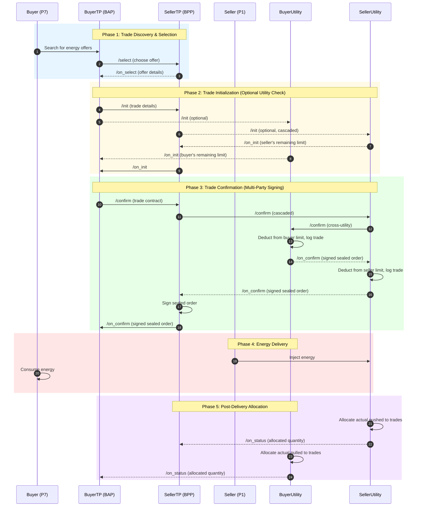
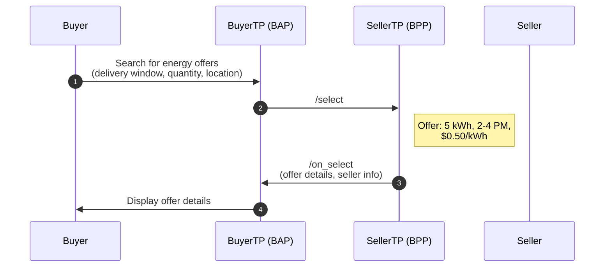
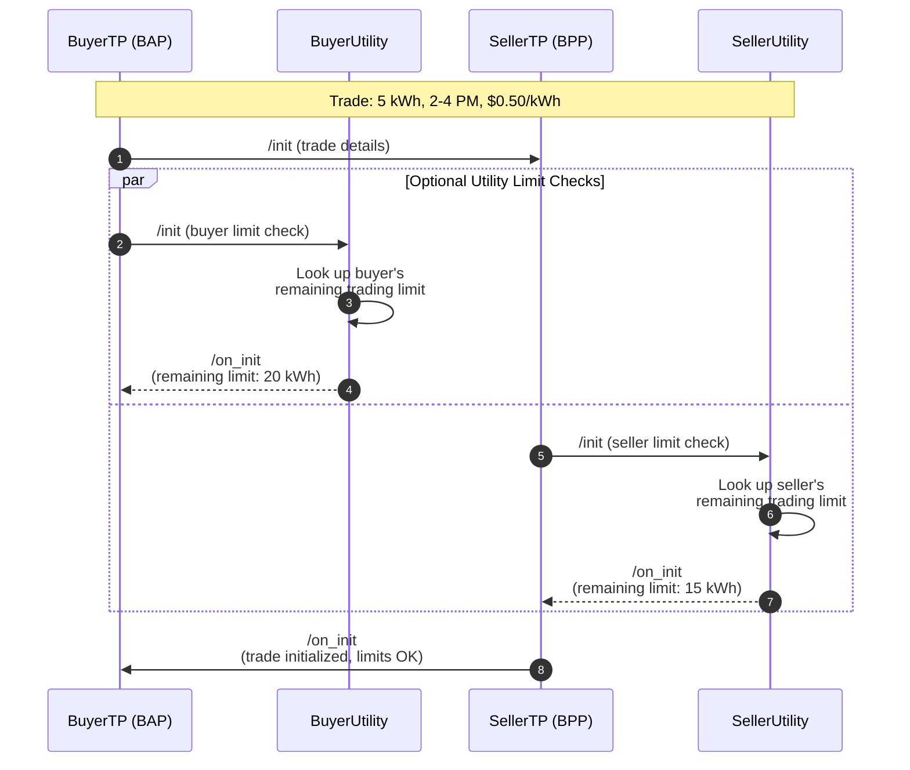
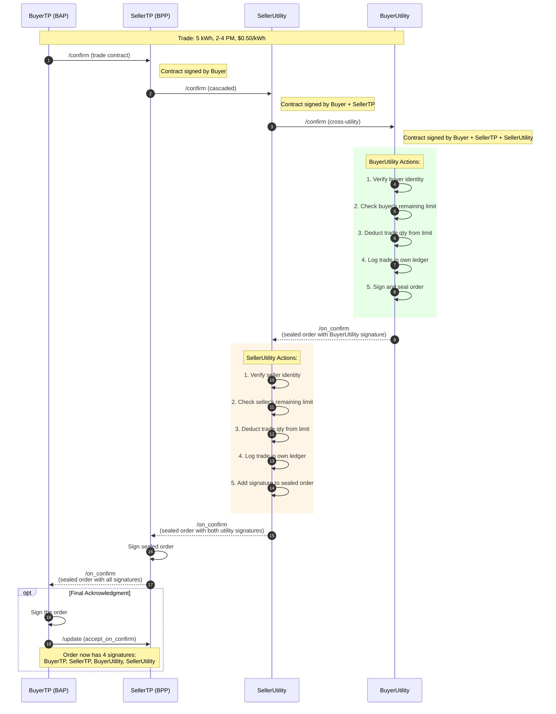
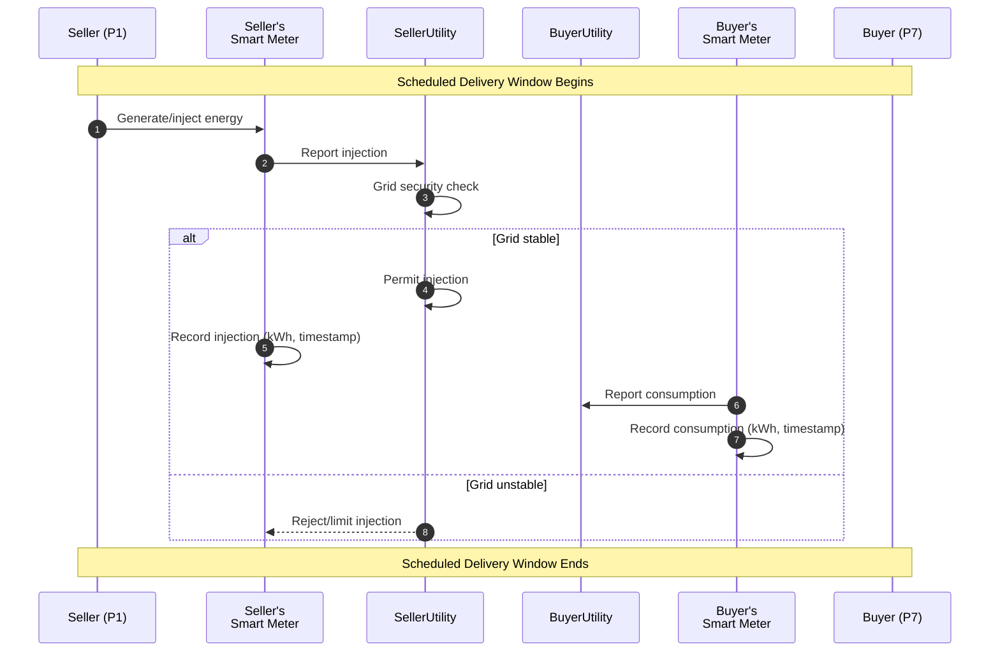
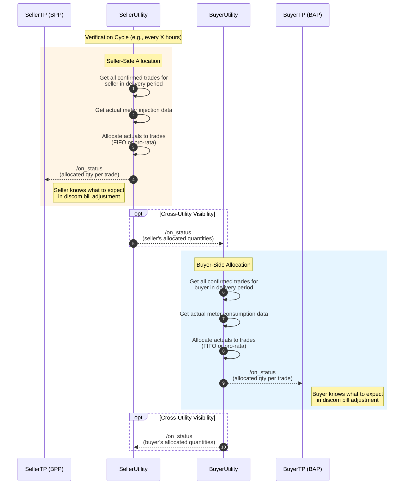
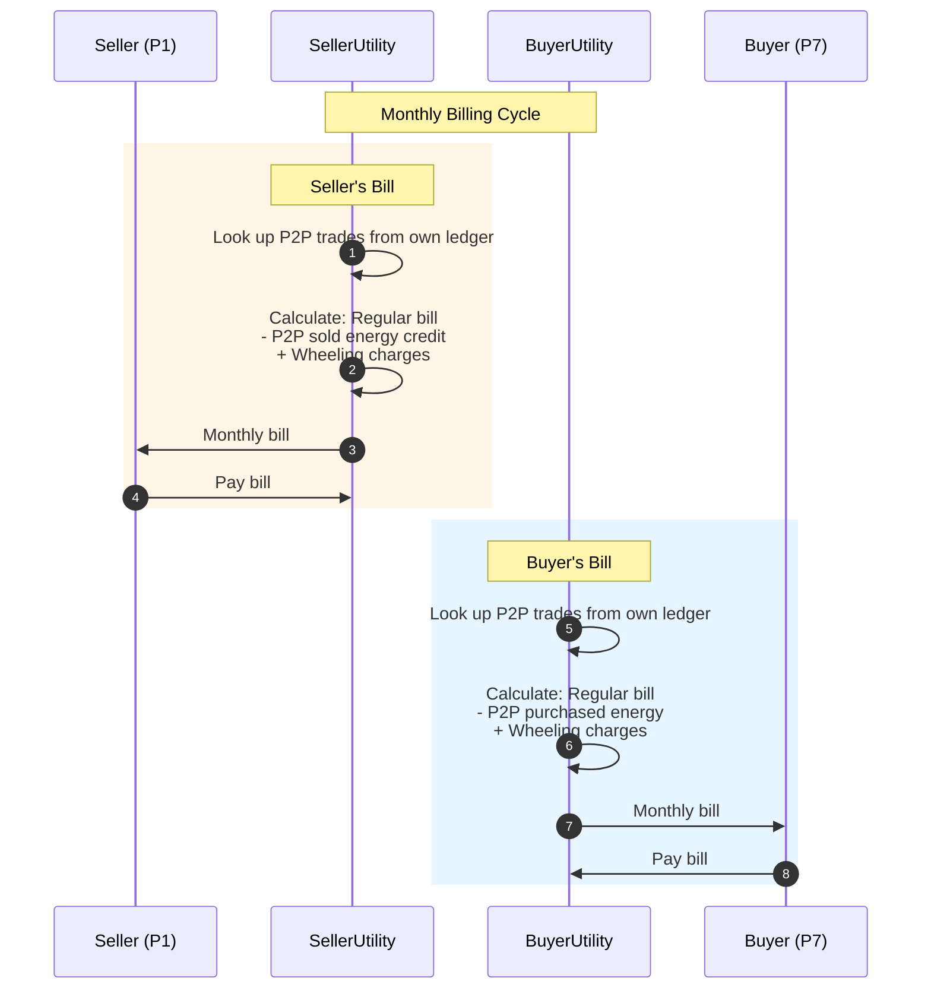
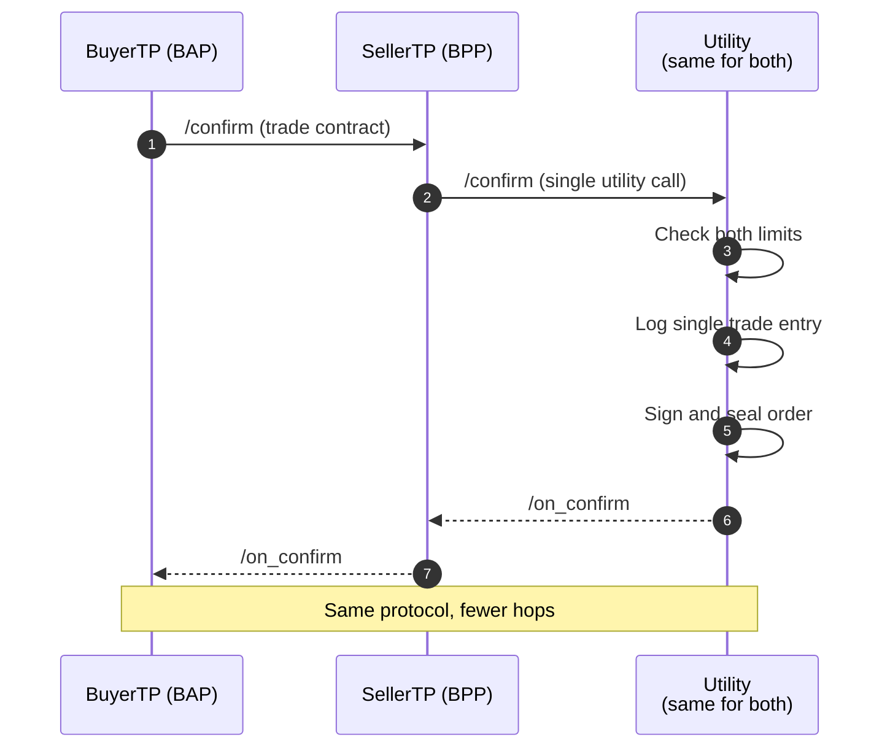

# Inter-Energy Retailer P2P Energy Trading (Decentralized Approach)

## Overview

This document describes an alternative approach to inter-energy retailer P2P trading that **eliminates the need for a central trade exchange/ledger**. Instead, each utility maintains its own ledger for its customers, and trust is established through cascading Beckn protocol calls with multi-party digital signatures.

For the original approach using a central ledger, see [Inter_energy_retailer_P2P_trading_draft.md](./Inter_energy_retailer_P2P_trading_draft.md).

For a detailed comparison of both approaches, see [Central_vs_Decentralized_Ledger_Comparison.md](./Central_vs_Decentralized_Ledger_Comparison.md).

---

## Scenario

P2P trading between prosumers belonging to different energy retailers/distribution utilities (discoms). Each discom handles routine activities: providing electricity connections, certifying meters, billing, maintaining grid infrastructure, and ensuring grid resilience within their jurisdiction.

**Example:** Prosumer P1 (Meter ID: M1, Utility A) sells electricity to Prosumer P7 (Meter ID: M7, Utility B).

---

## Key Architectural Difference

| Aspect | Central Ledger Approach | Decentralized Approach |
|--------|------------------------|------------------------|
| Trade records | Single central ledger (Trade Exchange) | Each utility maintains its own ledger |
| Trust model | All parties trust the central ledger | Multi-party signatures create distributed proof |
| Trading limits | Central ledger tracks all limits | Each utility tracks only its own customers' limits |
| Reconciliation | Central ledger allocates actual energy | Each utility allocates for its own customers |
| Privacy | Central entity sees all trade details | Each utility only sees trades involving its customers |

---

## Actors

| # | Actor | Role | Beckn Role |
|---|-------|------|------------|
| 1 | **BuyerTP** | Consumer's trading platform | BAP (Beckn Application Platform) |
| 2 | **SellerTP** | Producer's trading platform | BPP (Beckn Provider Platform) |
| 3 | **BuyerUtility** | Buyer's energy retailer/distribution company | BPP (for limit checks and settlement) |
| 4 | **SellerUtility** | Seller's energy retailer/distribution company | BPP (for limit checks and settlement) |
| 5 | **Buyer** | Energy consumer in P2P trade | End user |
| 6 | **Seller** | Energy producer in P2P trade | End user |

> **Note:** When buyer and seller are with the **same utility**, the flow simplifies naturally - BuyerUtility and SellerUtility collapse into a single entity, reducing the number of hops while maintaining the same protocol structure.

---

## Core Design Principles

1. **BAP-initiated flows**: All transactions start from BuyerTP (BAP), maintaining Beckn protocol symmetry
2. **Cascading calls**: Multi-party flows cascade through SellerTP to both utilities
3. **Optional utility involvement**: Utility participation in init/confirm is optional but recommended for trading limit enforcement
4. **Distributed ledgers**: Each utility maintains its own ledger for its customers only
5. **Multi-party signatures**: Tamper-proof audit trail through sequential signing
6. **Natural collapse**: Same-utility trades collapse to single-discom flow automatically

---

## Overall Process Flow

---

## Phase 1: Trade Discovery and Selection

This phase follows standard Beckn discovery flow. Buyer searches for energy offers and selects one.

---

## Phase 2: Trade Initialization

The initialization phase optionally checks trading limits with both utilities. This is optional but recommended to prevent trade failures at confirmation time.

### Why Check Limits?

Each utility may impose trading limits on its customers to:
- Manage grid capacity
- Control financial exposure
- Comply with regulatory requirements

### Initialization Flow

### What Each Utility Tracks in Its Own Ledger

| Data Element | Owner | Description |
|--------------|-------|-------------|
| Customer's trading limit | Customer's utility | Max energy that customer can trade in a period |
| Customer's confirmed trades | Customer's utility | All confirmed trades for the customer |
| Customer's actual delivery/consumption | Customer's utility | Metered data for the customer |
| Customer's allocated trade quantities | Customer's utility | Post-delivery allocation of actuals to trades |

---

## Phase 3: Trade Confirmation (Multi-Party Signing)

This is the critical phase that establishes trust without a central ledger. The confirmation cascades through all parties, with each adding their signature to create a tamper-proof audit trail.

### Confirmation Flow

### Multi-Party Signature Chain

By the end of confirmation, the sealed trade order contains:

| Signature | Attests To |
|-----------|-----------|
| BuyerTP | Buyer's intent to purchase |
| SellerTP | Seller's agreement to supply |
| BuyerUtility | Trade is within buyer's limits, logged in buyer's utility ledger |
| SellerUtility | Trade is within seller's limits, logged in seller's utility ledger |

This creates a **tamper-proof, distributed proof of trade commitment** without requiring a central ledger.

---

## Phase 4: Energy Delivery

Energy delivery follows the same physical process as the central ledger approach. The key difference is that each utility records meter data in its own ledger.

---

## Phase 5: Post-Delivery Allocation and Status

After the delivery window, each utility performs allocation independently for its own customers and notifies the relevant trading platforms.

### Why Allocation Matters

A prosumer may have multiple trades in the same delivery window but inject/consume less than the total contracted amount. Each utility must allocate actual meter readings to specific trades to determine:
- What quantity was actually delivered/received for each trade
- What to include in billing adjustments
- Whether penalties apply for under-delivery

### Allocation Flow

### Allocation Example (FIFO)

**Seller P1's trades for delivery window 2-4 PM:**

| Trade | Trade Time | Contracted Qty | Priority |
|-------|------------|----------------|----------|
| T1 (with P7) | 9:00 AM | 5 kWh | 1st |
| T2 (with P8) | 9:30 AM | 4 kWh | 2nd |
| **Total** | | **9 kWh** | |

**Actual injection: 7 kWh**

**SellerUtility allocation (FIFO):**

| Trade | Contracted | Allocated | Status |
|-------|------------|-----------|--------|
| T1 | 5 kWh | 5 kWh | Full delivery |
| T2 | 4 kWh | 2 kWh | Partial delivery |

SellerUtility sends `/on_status` to SellerTP with these allocated quantities.

---

## Phase 6: Billing and Settlement

Each utility handles billing for its own customers, using only its own ledger data.

### Anti-Double-Billing

- **Buyer (P7):** BuyerUtility excludes P2P energy from regular charges (buyer already paid seller directly)
- **Seller (P1):** SellerUtility excludes P2P energy from injection credit (seller already received payment from buyer)

---

## Same-Utility Collapse

When buyer and seller are with the **same utility**, the flow simplifies naturally:

The protocol structure remains identical, but:
- Only one utility is involved
- No cross-utility confirm/on_confirm
- Single ledger entry (but from same utility's perspective for both parties)

---

## Comparison with Central Ledger Approach

| Aspect | Central Ledger | Decentralized (This Approach) |
|--------|---------------|------------------------------|
| **Trust model** | All trust central exchange | Multi-party signatures |
| **Privacy** | Central entity sees all trades | Each utility sees only its customers' trades |
| **Single point of failure** | Yes (central ledger) | No |
| **Cross-utility coordination** | Via central ledger queries | Via cascading Beckn calls |
| **Regulatory complexity** | Central exchange needs regulation | Each utility self-regulates |
| **Deployment** | Requires new central infrastructure | Builds on existing utility systems |
| **Dispute resolution** | Central ledger is arbiter | Multi-party signatures provide evidence |

---

## Open Questions

1. **Signature Format:** What cryptographic format for multi-party signatures? (JWS, EdDSA, etc.)

2. **Allocation Consistency:** If FIFO allocation differs between utilities for the same trade (due to data timing), how to reconcile?

3. **Cross-Utility Trust:** What compels SellerUtility to forward `/confirm` to BuyerUtility honestly?

4. **Offline Handling:** If a utility is temporarily unavailable during confirmation cascade, how to handle?

5. **Audit Trail Access:** How do trading platforms access the full signature chain for disputes?

---

[^1]: Non-exhaustive
