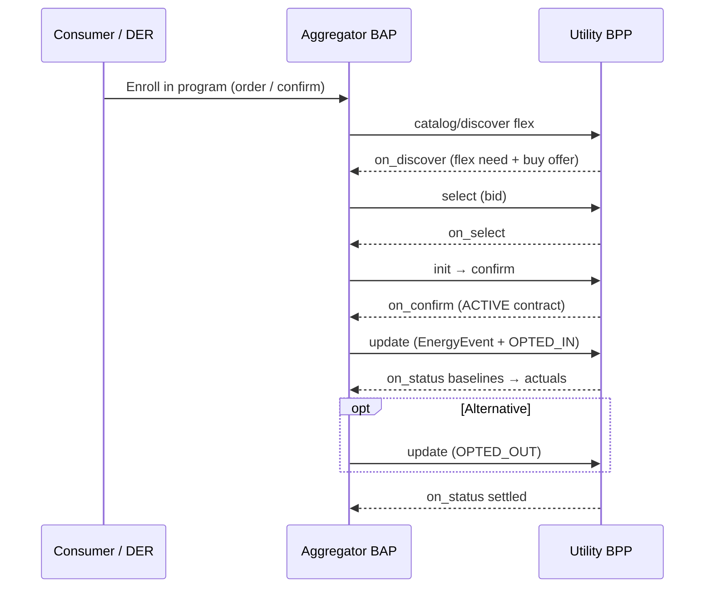

# Full lifecycle: program enrollment → flex offer → bid → BDR → opt-out / settlement

This folder ties together **enrollment** (`beckn.one:deg:p2p-enrollment`), **verifiable consent** (`EnergyConsentRecord`), and **demand-flex** (`beckn.one:deg:demand-flex`) using one narrative: **North Delhi Peak Flex**, utility **TPDDL**, aggregator **GreenFlex**, consumer **`did:example:consumer-north-delhi-001`**.

Stable ids for cross-referencing live in [`participants.json`](./participants.json).

## Lifecycle map

| # | Your term | What happens (Beckn / DEG) | Example file |
|---|-----------|----------------------------|--------------|
| 1 | **Program creation** (utility publishes program + flex need + buy offer) | `catalog/publish` on demand-flex domain | [`../../demand-flex/v2/publish-catalog.json`](../../demand-flex/v2/publish-catalog.json) |
| 2 | **Aggregator & consumer “creation”** (network identity) | Subscribers in registry (out of band); this repo uses fixed `bapId` / `bppId` / DIDs in `participants.json` | [`participants.json`](./participants.json) |
| 3 | **Customer enrolled into program** | Enrollment order flow: discover → select → init → **confirm** → `on_confirm` with `EnergyEnrollment` + credential | [`enrollment-confirm-north-delhi-flex-program.json`](./enrollment-confirm-north-delhi-flex-program.json) (confirm step) · full flow: [`../../enrollment/v2/`](../../enrollment/v2/) (`init-request-*.json`, `on-confirm-response-success.json`) |
| 4 | **Consent — program enrollment** (in-order attributes) | `EnergyEnrollment.consents[]` on enrollment `confirm` | [`enrollment-confirm-north-delhi-flex-program.json`](./enrollment-confirm-north-delhi-flex-program.json) |
| 5 | **Consent — utility / aggregator** (structured records) | Standalone **`EnergyConsentRecord`** per recipient / purpose | [`energy-consent-record-utility-metering.json`](./energy-consent-record-utility-metering.json) · [`energy-consent-record-aggregator.json`](./energy-consent-record-aggregator.json) |
| 6 | **Consent — flex offer & bid (aggregator acting for portfolio)** | Optional record linking settlement / offer participation | [`energy-consent-record-flex-offer-and-bid.json`](./energy-consent-record-flex-offer-and-bid.json) |
| 7 | **Flex offer** (published need + commercial terms) | Same catalog as row 1; discover returns offers | [`../../demand-flex/v2/publish-catalog.json`](../../demand-flex/v2/publish-catalog.json) |
| 8 | **Bid** | In demand-flex, the aggregator **selects** quantity and terms (analogous to binding a bid to an offer) | [`../../demand-flex/v2/select-request.json`](../../demand-flex/v2/select-request.json) |
| 9 | **Bid approval** | Utility responds with **`on_select`**, then **`init`** / **`on_init`**, then **`confirm`** / **`on_confirm`** — contract becomes **ACTIVE** | [`../../demand-flex/v2/on-select-response.json`](../../demand-flex/v2/on-select-response.json) · [`../../demand-flex/v2/confirm-request.json`](../../demand-flex/v2/confirm-request.json) · [`../../demand-flex/v2/on-confirm-response.json`](../../demand-flex/v2/on-confirm-response.json) |
| 10 | **EnergyEvent** + participation (opt-in path) | **`update`** with `energyEvents[]` + `energyEventParticipations[]` | [`../../demand-flex/v2/bdr-e2e/01-update-bdr-event-and-participation.json`](../../demand-flex/v2/bdr-e2e/01-update-bdr-event-and-participation.json) |
| 11 | **Opt-out** | Same BDR slots; **`OPTED_OUT`** on `energyEventParticipations[]` | [`update-bdr-opt-out.json`](./update-bdr-opt-out.json) |
| 12 | **EnergyEvent measurement** | **`on_status`** with `energyEventMeasurements[]` + `DemandFlexPerformance` | [`../../demand-flex/v2/bdr-e2e/02-on-status-bdr-baselines.json`](../../demand-flex/v2/bdr-e2e/02-on-status-bdr-baselines.json) → [`03-on-status-bdr-actuals.json`](../../demand-flex/v2/bdr-e2e/03-on-status-bdr-actuals.json) |
| 13 | **Settlement** | **`on_status`** with `energySettlements[]`, `DEGContract.revenueFlows` | [`../../demand-flex/v2/bdr-e2e/04-on-status-bdr-settled.json`](../../demand-flex/v2/bdr-e2e/04-on-status-bdr-settled.json) |

## Sequence (high level)

## Schema context

- Enrollment payloads follow existing **`EnergyEnrollment`** examples under [`../../enrollment/v2/`](../../enrollment/v2/) (core `@context` URLs may still reference `protocol-specifications-new`; align with your deployed branch when integrating).
- Demand-flex + BDR use **`context.schemaContext`** with DEG `deg-prime-mvp` **`context.jsonld`** entries — see any file under [`../../demand-flex/v2/`](../../demand-flex/v2/).
- **`EnergyConsentRecord`**: examples here use the DEG-hosted context:  
  `https://raw.githubusercontent.com/beckn/DEG/refs/heads/deg-prime-mvp/specification/schema/EnergyConsentRecord/v2.0/context.jsonld`

## Related guide

[Demand Flexibility implementation guide](../../../docs/implementation-guides/v2/Demand_Flexibility/Demand_Flexibility.md) §4–5 and BDR end-to-end folder [`../../demand-flex/v2/bdr-e2e/README.md`](../../demand-flex/v2/bdr-e2e/README.md).
